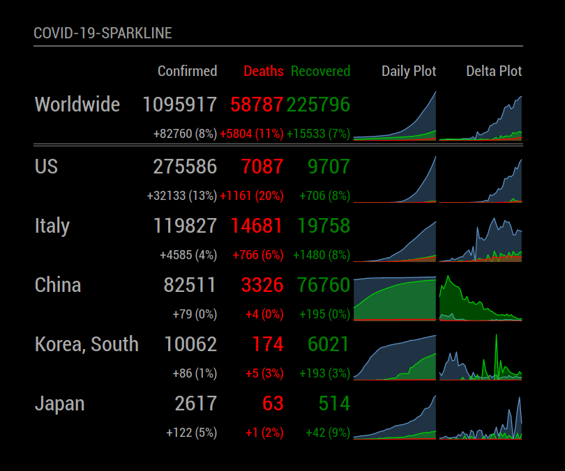
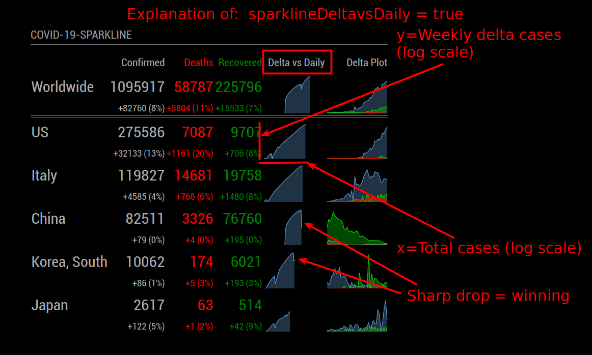

# MMM-COVID19-SPARKLINE
A [MagicMirror](https://magicmirror.builders) helper module to track reported cases of COVID-19 with sparkline plots.

[](https://raw.githubusercontent.com/skelliam/MMM-COVID19-SPARKLINE/master/LICENSE)

This work is a combination of two other plugins:

* [MMM-COVID19](https://github.com/bibaldo/MMM-COVID19) by Jose Forte
  * This plugin has a clean design, but I didn't care for the rapidapi.com service that it used as a data source.  If you look at my commit history, you'll find a version of Jose's plugin where I've added plot capability.
* [MMM-COVID-19](https://github.com/eouia/MMM-COVID-19) by Seongnoh Sean Yi
  * This plugin uses GitHub as a backend, the same data source that is used by the famous [Johns Hopkins Map](https://coronavirus.jhu.edu/map.html).  I prefer the use of this data source.

At the end of the day, I decided to merge the two approaches to get what I wanted, adding the use of the awesome [highcharts.js](https://www.highcharts.com/) to get sparkline plots next to the daily totals.

* sparklines on/off
* line showing numeric delta change of each column
* delta plot
* weekly delta vs. total cases plot (see explanation below)
* configurable column displays
* configurable sparkline size
* configurable number of days to plot in sparklines
* configurable number delimiters (thanks @BrianHepler!)

## Screenshot



## sparklineDeltavsDaily = true

New option added 4-April-2020.  This option was inspired by YouTube producer [minutephysics](https://www.youtube.com/channel/UCUHW94eEFW7hkUMVaZz4eDg), who proposes plotting the total number of cases on the X-axis and the weekly change in cases on the Y-axis to help visualize whether or not we're winning the battle against COVID-19.  See his video [here](https://www.youtube.com/watch?v=54XLXg4fYsc).

If you enable this option, the daily plot will no longer be shown.  Honestly, the daily plot is not that interesting, as it only shows that the rate of infection is exponential.  This plot at least gives you something to look (hope) for.

Note: This type of plot ignores the "sparklineDays" directive; it always shows all available data.



## Installation

In your terminal, go to your MagicMirror's Module folder:
````
cd ~/MagicMirror/modules
````

Clone this repository:
````
git clone https://github.com/skelliam/MMM-COVID19-SPARKLINE.git
````

Change to plugin directory and fetch dependencies:
````
cd MMM-COVID19-SPARKLINE
npm install
````

Add the module to the modules array in the `config/config.js` file:
````javascript
  {
    module: 'MMM-COVID19-SPARKLINE'
  },
````

## Configuration options

The following properties can be configured:


| Option                       | Description
| ---------------------------- | -----------
| `header`                     | The header text <br><br> **Default value:** `'COVID-19-SPARKLINE'`
| `worldStats`                 | Worldwide stats <br><br> **OPTIONAL** <br> **Possible values:** `false` or `true` <br> **Default value:** `true`
| `countries`                  | The countries that we want to get COVID-19 stats <br><br> **Possible values:** `[  "Argentina, "US" ]` <br> **Default value:** `[ "US", "Italy", "Germany", "Canada", "Mexico" ]`
| `orderCountriesByName`       |  Order results by country name (asc) <br><br> **OPTIONAL** <br> **Possible values:** `false` or `true` <br> **Default value:** `false`
| `lastUpdateInfo`             | Last update info in UTC Time <br><br> **OPTIONAL** <br> **Possible values:** `false` or `true` <br> **Default value:** `false`
| `headerRowClass`             | The font size of the row headers <br><br> **Possible values:** `'small'`, `'medium'`, `'big'` <br> **Default value:** `'small'`
| `infoRowClass`               | The font size of data <br><br> **Possible values:** `'small'`, `'medium'`, `'big'` <br> **Default value:** `'medium'`
| `updateInterval`             | How often does the content needs to be fetched? (Milliseconds) <br><br> **Possible values:** `1000` - `86400000` <br> **Default value:** `10800000` (3 hours) <br> Note that this data is updated once daily, so setting this to a small value will not force updates faster, it will only put a burden on github.
| `columns`                    | The columns you wish to be displayed.  **Possible values:** `[ "confirmed", "deaths", "recovered"]` <br> **Default value:** `[ "confirmed", "deaths", "recovered" ]`
| `fadeSpeed`                  | Fade speed in ms <br> **Default value:** `1000`
| `sparklines`                 | Show sparkline plots or not <br> **Default value:** `true`
| `sparklineWidth`             | width of sparkline in px <br> **Default value:** `120`
| `sparklineHeight`            | height of sparkline in px <br> **Default value:** `30`
| `sparklineDays`              | Number of days to show in plot, specify 0 for all available days <br> **Default value:** `0`
| `showDelta`                  | Whether or not to show the change from the last measurement <br> **Default value:** `false`
| `sparklineDeltavsDaily`      | will show Delta vs Daily plot, see https://www.youtube.com/watch?v=54XLXg4fYsc <br> **Default value:** `false`
| `showDelimiter`              | Will add number delimiters for easier reading. (34567 becomes 34,567) <br> **Default value: false**
| `delimiter`                  | The character used as the number delimiter.<br> **Default value:** `","`

## Config Example

````javascript
    {
    module: 'MMM-COVID19-SPARKLINE',
      position: "bottom_left",
      config : {
        worldStats: true,
        sparklines: true,
        sparklineWidth: 100,
        sparklineHeight: 55,
        sparklineDays: 50,
        sparklineDeltavsDaily: true, 
        sortby: "confirmed",
        columns: ["confirmed", "deaths", "recovered"],
        countries: ["US", "Italy", "Germany", "China", "Canada", "Mexico"],
        updateInterval: 1000 * 60 * 60 * 3,  //3 hours
        infoRowClass: "medium",
        headerRowClass: "small",
        fadeSpeed: 1000,
        showDelta: true,
      }
    },
````
## Updating

To update the module to the latest version, use your terminal to go to your MMM-COVID19-SPARKLINE module folder and type the following commands:

````
cd MMM-COVID19-SPARKLINE
git pull
npm install
```` 

## Development

Probably I will not actively maintain this plugin unless it breaks.  If you want to modify it, that's great, please make a pull request.

## Thanks

Thanks to Jose Forte and Seongnoh Sean Yi for your plugins, I borrowed heavily from your work to create this derivative work.
